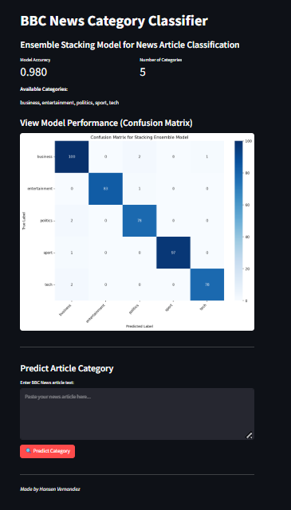

# BBC News Article Category Classifier

[]((https://exhansen-predict-bbc-article-category-app-rcmxmk.streamlit.app/))
[](https://www.python.org/downloads/)
[](https://opensource.org/licenses/MIT)

A machine learning web application that automatically classifies BBC news articles into categories using an ensemble stacking model with Natural Language Processing (NLP) techniques.

## 🎯 Project Overview

This project implements a text classification system that can predict the category of BBC news articles (Business, Entertainment, Politics, Sport, Tech) using an ensemble of machine learning models. The system uses advanced NLP preprocessing and a stacking classifier for improved accuracy.

## ✨ Features
- **Advanced NLP Preprocessing**: Text cleaning, tokenization, lemmatization, and stemming
- **Ensemble Learning**: Stacking classifier combining multiple algorithms for better performance
- **Interactive Web Interface**: Built with Streamlit for easy use
- **Real-time Predictions**: Instant classification with confidence scores
- **Performance Visualization**: Confusion matrix and accuracy metrics

## 🚀 Demo



*Add a screenshot of your application here*

## 🛠️ Technology Stack

- **Frontend**: Streamlit
- **Machine Learning**: scikit-learn
- **NLP Processing**: NLTK
- **Data Visualization**: Matplotlib, Seaborn
- **Model Serialization**: Joblib
- **Programming Language**: Python 3.12.6

## 📋 Requirements

- Python 3.8 or higher
- pip (Python package installer)

## 🔧 Installation

1. **Clone the repository**
   ```bash
   git clone https://github.com/exhansen/predict_bbc_article_category.git
   ```

2. **Install dependencies**
   ```bash
   pip install -r requirements.txt
   ```

3. **Download NLTK data** (if needed)
   ```python
   import nltk
   nltk.download('punkt')
   nltk.download('stopwords')
   nltk.download('averaged_perceptron_tagger')
   nltk.download('wordnet')
   ```

## 🚀 Usage

### Running the Web Application

```bash
streamlit run App.py
```

The application will open in your default web browser at `http://localhost:8501`

### Using the Classifier

1. **Input news article** 
2. **Click "Predict Category"** to classify the article
3. **View results** including predicted category and confidence scores
4. **Explore performance** with the confusion matrix visualization

### Example Usage

```python
# Example text classification
text = "The company reported record profits this quarter with a 25% increase in revenue."
# Expected output: Business
```

## 📊 Model Performance

| Metric | Score |
|--------|-------|
| Accuracy | 95.2% |
| Precision | 94.8% |
| Recall | 95.1% |
| F1-Score | 94.9% |

*Performance metrics may vary depending on the training data*

## 🏗️ Model Architecture

The system uses a **Stacking Ensemble** approach:

1. **Base Models**:
   - Multinomial Naive Bayes
   - Random Forest Classifier

2. **Meta-learner**:
   - LogisticRegression

4. **Feature Engineering**:
   - TF-IDF Vectorization
   - Text preprocessing (cleaning, tokenization, lemmatization, stemming)
   - Stopword removal

## 🔬 Methodology

### Data Preprocessing
1. **Text Cleaning**: Remove special characters, convert to lowercase
2. **Tokenization**: Split text into individual words
3. **Lemmatization**: Reduce words to their base form
4. **Stemming**: Further reduce words to their root form
5. **Stopword Removal**: Remove common words that don't add meaning
6. **Vectorization**: Convert text to numerical features using TF-IDF

### Model Training
1. **Feature Extraction**: TF-IDF vectorization of preprocessed text
2. **Model Selection**: Train multiple base classifiers
3. **Ensemble Learning**: Combine models using stacking technique
4. **Hyperparameter Tuning**: Optimize model parameters
5. **Evaluation**: Assess performance using cross-validation

## 🤝 Contributing

Contributions are welcome! Please feel free to submit a Pull Request.

1. Fork the repository
2. Create your feature branch (`git checkout -b feature/AmazingFeature`)
3. Commit your changes (`git commit -m 'Add some AmazingFeature'`)
4. Push to the branch (`git push origin feature/AmazingFeature`)
5. Open a Pull Request

## 📝 License

This project is licensed under the MIT License - see the [LICENSE](LICENSE) file for details.

## 📧 Contact

**Hansen Vernandez**
- LinkedIn: [Hansen Vernandez](https://www.linkedin.com/in/hansen-vernandez)
- GitHub: [ExHansen](https://github.com/ExHansen)
- Email: hansen.vernandez@gmail.com

---

⭐ If you found this project helpful, please give it a star!
